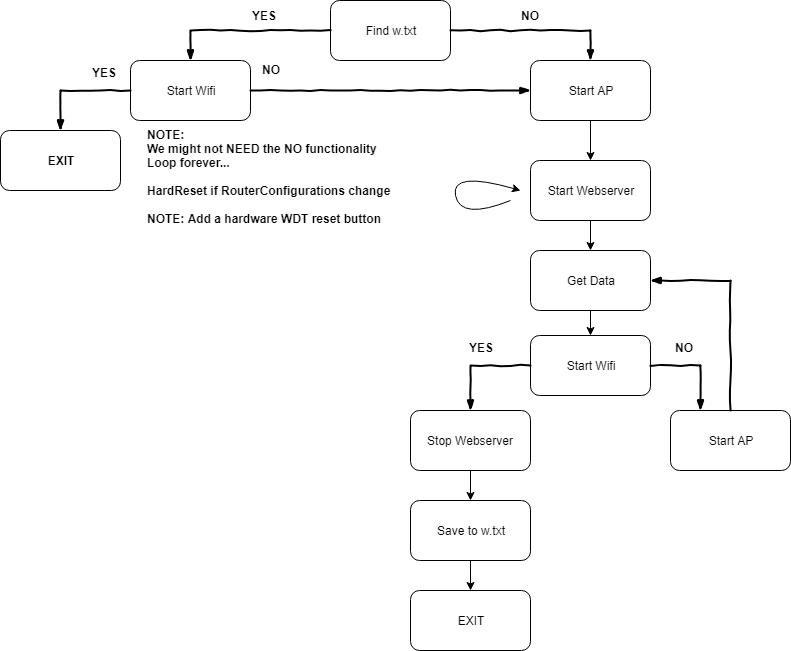

Table of Contents

- [APManager](#apmanager)
- [Purpose](#purpose)
- [Pre-Requisites](#pre-requisites)
- [Device Endpoints / Schema](#device-endpoints--schema)
  - [GET](#get)
    - [/deviceInfo](#deviceinfo)
    - [/scanInfo](#scaninfo)
  - [POST](#post)
    - [/connectWifi](#connectwifi)

# APManager

Using the platformio IDE to create an APManager similar to the [WifiManager](https://github.com/tzapu/WiFiManager)

# Purpose

Uses HTTP Requests to Webserver to configure the ESP8266 device. 

This lets us embed the portal/configuration inside a custom application

# Pre-Requisites

- cJSON
  - Used for parsing JSON objects that are received while configuring the device

NOTE: The **APManager** library will be present inside the `lib` folder. Can be copy pasted to the project of your choice.

# Device Endpoints / Schema

## GET

### /deviceInfo

- Gets the device Mac address.
- Other unique device attributes can be returned here

``` json
{
    "macaddress":"$unique_mac_address"
}
```

### /scanInfo

This request scans for access points near the device

**NOTE: The scan can take 2000-3000ms. Configure your HTTP Clients appropriately**

- Gets a JSON Object of the SSID and RSSI of WiFi points near the device

``` json
{
    "networks": [
        {
            "ssid" : "$ssid_1",
            "rssi" : "$rssi_1"
        },
        {
            "ssid" : "$ssid_2",
            "rssi" : "$rssi_2"
        },
        {
            ...
        }
    ]
}
```

## POST

### /connectWifi

Tries to establish connection to the device

``` json
{
    "ssid" : "$ssid",
    "password" : "$password"
}
```



